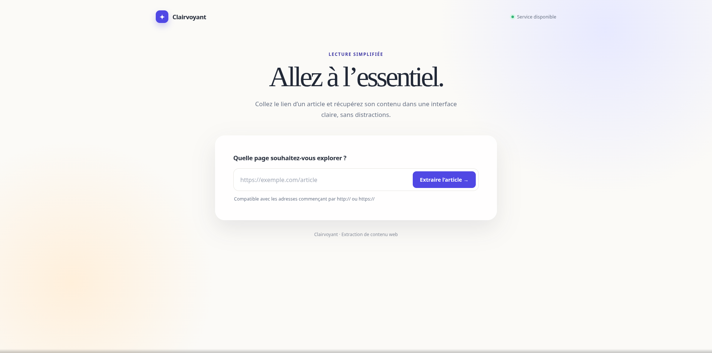

# Clairvoyant

Clairvoyant est une application web Flask qui extrait rapidement le contenu textuel d’une page d’actualité à partir de son URL.

L’interface adopte un style éditorial minimaliste afin de lire le résultat sans distractions.

## Aperçu



## Fonctionnalités

- Saisie et validation d’une URL HTTP ou HTTPS
- Récupération du contenu avec `requests`
- Extraction du titre, de la description, de l’auteur, de la date et de l’image principale
- Nettoyage du contenu pour retirer les menus, scripts, formulaires et éléments inutiles
- Respect de `robots.txt` lorsque le site le fournit
- Détection des refus d’accès (`401`, `403`), des limitations (`429`) et des CAPTCHA
- Limitation des requêtes rapprochées pour éviter de surcharger les sites
- Affichage des erreurs réseau ou des URLs invalides
- Interface responsive pour ordinateur et mobile

## Technologies

- Python 3
- Flask
- Requests
- BeautifulSoup 4
- HTML et CSS natifs

## Installation

### 1. Cloner le projet

```bash
git clone https://github.com/hdmanoach/Web-scraper-to-get-news-article-content.git
cd Web-scraper-to-get-news-article-content
```

### 2. Créer l’environnement virtuel

Linux/macOS :

```bash
python3 -m venv venv
source venv/bin/activate
```

Windows :

```powershell
python -m venv venv
venv\Scripts\activate
```

### 3. Installer les dépendances

```bash
pip install -r requirements.txt
```

## Lancer l’application

Depuis la racine du projet :

```bash
flask --app app run --debug
```

L’application est ensuite disponible à l’adresse :

```text
http://127.0.0.1:5000/
```

Une autre méthode de lancement est possible :

```bash
python app.py
```

## Structure du projet

```text
.
├── app.py                  # Application Flask et logique de scraping
├── requirements.txt        # Dépendances Python
├── templates/
│   └── champs.html          # Interface utilisateur
├── docs/
│   └── clair.png            # Capture d’écran de l’application
└── README.md
```

## Limites

Le scraper dépend de la structure et des règles de chaque site. Certains sites peuvent bloquer les requêtes automatisées, nécessiter JavaScript ou ne pas exposer leur contenu directement. Dans ce cas, un message d’erreur est affiché.

Clairvoyant ne contourne pas les CAPTCHA, les authentifications ou les protections anti-scraping. Pour les sites qui refusent l’accès, utilisez leur API officielle, leur flux RSS ou demandez une autorisation.

Utilisez cet outil uniquement sur des pages accessibles légalement et respectez les conditions d’utilisation des sites consultés.

## Auteur

[Manoach HOSSOU DODO](https://github.com/hdmanoach)
